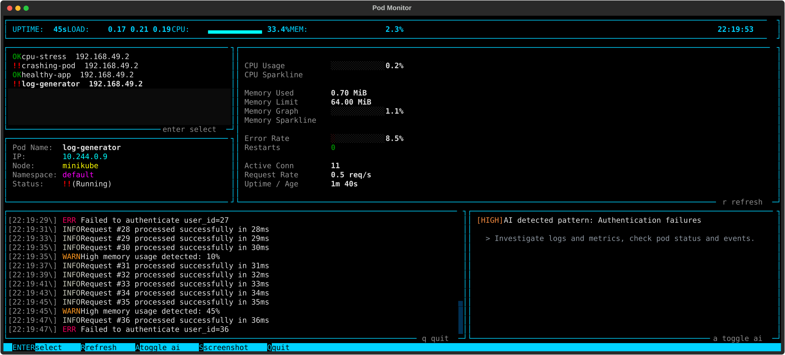
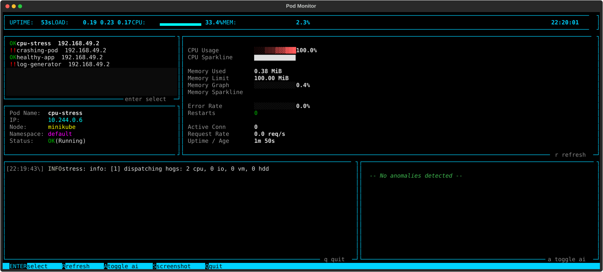

# KubeSense

KubeSense is an advanced, terminal-based User Interface (TUI) tool specifically designed for real-time Kubernetes pod monitoring. By leveraging the official Kubernetes Python API and the Textual framework, KubeSense delivers a high-density, system-monitor style dashboard directly to your command line. It enables administrators and developers to instantly visualize cluster health, track dynamic CPU and memory usage, tail container logs, and run passive AI-driven log anomaly detection without requiring complex graphical interfaces.

## Installation
KubeSense requires Python 3.10 or higher and relies on a locally configured `kubectl` context to authenticate with your Kubernetes cluster.

1. Clone the repository and navigate into the directory:
   ```bash
   git clone https://github.com/Joydeep2005Banik/pod_monitor.git
   cd pod_monitor
   ```

2. Create and activate an isolated virtual environment:
   ```bash
   python3 -m venv venv
   source venv/bin/activate
   ```

3. Install the required dependencies:
   ```bash
   pip install -r requirements.txt
   ```

## Setup and Usage

To effectively utilize KubeSense, follow the steps below to prepare your environment and workloads.

### 1. Deploy a Cluster
Ensure you have an active Kubernetes cluster and a valid local `KUBECONFIG`. For local testing, you can deploy a lightweight cluster using Minikube:

```bash
minikube start
```

### 2. Configure the Application
You can customize application behaviors by modifying the `config.yaml` file located in the root directory. KubeSense connects to your cluster primarily via your local Kubernetes context, but it also supports a direct SSH fallback mechanism for retrieving node-level metrics if API metrics fail.

To configure how KubeSense connects to your cluster, edit the `config.yaml` file. Below is an example that demonstrates setting the Kubernetes context and defining the SSH credentials for a local Minikube instance:

```yaml
# SSH Connection Settings (Fallback)
ssh:
  host: "192.168.49.2"
  user: "docker"
  password: ""
  key_path: "~/.minikube/machines/minikube/id_rsa"
  port: 22
  timeout: 30

monitor:
  # Mode defines the primary connection type
  mode: "kubectl"
  
  # Kubernetes context to use (must match a context in your ~/.kube/config)
  context: "minikube"
  
  namespaces:
    - "default"
  refresh_interval: 5
  log_lines_to_fetch: 50
  anomaly_threshold: 3
```

### 3. Deploy Workloads (Pods)
KubeSense requires active pods in your cluster to monitor. You can deploy your own workloads or use the provided test configuration located in `tests/test-pod.yaml`, which includes healthy, crashing, and high-load pods to test the UI limits.

To deploy the test pods, examine the file to understand the workloads. For example, a basic log generator pod is defined as:

```yaml
apiVersion: v1
kind: Pod
metadata:
  name: log-generator
  labels:
    app: log-generator
spec:
  containers:
  - name: logger
    image: busybox
    resources:
      limits:
        memory: "64Mi"
        cpu: "100m"
    command: ["/bin/sh", "-c"]
    args:
      - |
        while true; do
          echo "$(date -u +'%Y-%m-%dT%H:%M:%SZ') INFO Request processed successfully"
          sleep 2
        done
```

Apply this configuration to your cluster using `kubectl`:

```bash
kubectl apply -f tests/test-pod.yaml
```

### 4. Launch KubeSense
Once your cluster is running and pods are deployed, execute the following command while your virtual environment is active to start the dashboard:

```bash
python -m pod_monitor
```

### Interface Controls
- **Up/Down Arrow Keys or Mouse Click**: Select a specific pod from the sidebar to inspect its detailed metrics and live logs.
- **R**: Manually refresh the data feed for the current view.
- **A**: Toggle the AI-powered log analysis module.
- **S**: Capture and save an SVG screenshot of the current interface.
- **Q**: Terminate the application safely.

## Terminal User Interface

The KubeSense interface provides an immediate, high-density visual summary of your infrastructure without leaving the command line. Below are captures of the application in operation:





## Under Development
KubeSense is currently in active development. Core features such as basic metrics visualization and native Kubernetes API integration are stable, but several background processors and error-handling routines are undergoing rigorous testing. Specifically, the AI-driven log anomaly detection and integration features are currently pending and under active development. These advanced AI capabilities will be formally rolled out in future iterations once the algorithmic heuristics are completely stabilized.

## Future Possible Scopes
As development continues, the KubeSense roadmap includes several architectural and feature-based expansions to improve scalability and user experience:

- **Expanded Theme Set**: Introducing comprehensive color schemes and visual themes to support various terminal environments and user accessibility preferences.
- **Environment Variable Configuration**: Implementing robust support for passing configurations via Environment Variables. This will deprecate strict reliance on local YAML files, significantly simplifying deployment across disparate environments and automated CI/CD pipelines.
